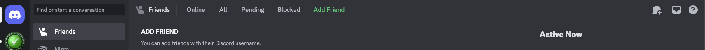

<div style="text-align: right"></div>

# Discord

This is a collaborative group, and collaboration may take place during and independently of meetups.
Clean Coders Collaborative chooses Discord for collaboration because in one tool it supports both the
virtual meetup video collaboration and “anytime” chat collaboration between members, including video!

It is not just a gamers tool.
Most of us use multiple collaboration tools anyhow, and if you are not already using Discord what is one more?

## Discord is Free!



### Security :(

We ask that you establish a verified account at Discord, which simply means that you have to provide a valid telephone number
that can be checked with an SMS text message.
We are not going to see or use that number, but verified accounts are less likely to be a source pf Spam.

Discord discourages using your phone number for SMS multi-factor authentication.
They are correct that it may be weak, but it also is a good backup if you loose or break your device
and an authenticator app or passkey is not available.
An SMS one-time passcode would be a good backup once the number works again.

### Browser

If you want to avoid adding an application to your computer, or maybe you are not allowed to, using the browser-based
Discord application is a choice. Just go to https://discord.com. 

### Apple MacOS

Two installation options:

1. Use the Homebrew package manager ($ is the command prompt):
    ```
    $ brew install --cask discord
    ```

1. Download and install: https://discord.com/download.

### Microsoft Windows

Two installation options:

1. Use Chocolatey package manager ($ is the command prompt):
    ```
    $ choco install discord
    ```

1. Download and install: https://discord.com/download.

### Linux

Two installation options:

1. Use the Snap package manager ($ is the prompt):
    ```
    $ sudo snap install discord
    ```

1. Download and installn (.deb for Debian/Ubuntu/Mint, .tar.gz for everyone): https://discord.com/download.

## Register your phone number

Open User Settings, pick *My Account*, and in the first section add your phone number.
Verify it with the SMS passcode that Discord sends.

If you want to add SMS for MFA you must add an authenticator app first,
then SMS may be enabled. 